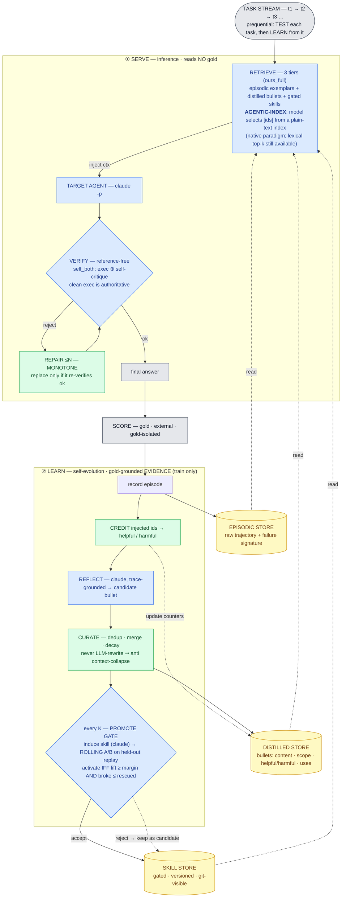

# native_evolve — method architecture

One self-evolving loop per task. Each task is first **served** (inference / test, reads no gold),
then **learned from** (self-evolution / train, uses gold-grounded evidence). Three persistent stores
carry knowledge across tasks, so *today's learning is tomorrow's context*. The **determinism rule**:
only the blue nodes call the LLM (`claude -p`); curation, crediting and the gate *decision* are
deterministic Python — the LLM proposes, Python disposes (anti ACE context-collapse).

## Diagram (Mermaid)



**Colour legend.** 🟦 involves a `claude -p` call · 🟩 pure deterministic Python ·
🟨 persistent store · ⬜ external / gold-isolated.
*Mixed nodes* `RETRIEVE` / `VERIFY` / `PROMOTE GATE` are coloured blue because they *contain* a
claude call (agentic select · self-critique · skill-induce + A/B), but their **decision logic**
(id parsing, the exec-authoritative veto, accept/reject by margin & non-dilution) is deterministic.

## Diagram (ASCII fallback)

```
┌──────────────────────────────────────────────────────────────────────────────┐
│  TASK STREAM   t1 → t2 → t3 → …      prequential: TEST each task, then LEARN     │
└───────────────────────────────────┬────────────────────────────────────────────┘
                                     │  task tᵢ
  ① S E R V E  (inference · reads NO gold)
  ┌──────────────────────────────────────────────────────────────────────────┐
  │ RETRIEVE  (3 tiers)   episodic exemplars + distilled bullets + gated skills │
  │      └─ AGENTIC-INDEX: the model selects [ids] from a plain-text index       │
  │                        (native paradigm; lexical top-k still available)      │
  └───────────────────────────────┬────────────────────────────────────────────┘
                       inject ctx  ▼
                 ┌───────────────────────────┐
                 │  TARGET AGENT  (claude)    │ ─► attempt
                 └─────────────┬──────────────┘
                               ▼
            VERIFY (reference-free: exec ⊕ self-critique, exec authoritative)
                 reject ─► REPAIR (≤N, MONOTONE: replace only if re-verifies ok) ─┐
                   │ ok                                                            │
                   ▼ ◄──────────────────────────────────────────────────────────-┘
               final answer ─►  SCORE (gold · external · isolated)
                                     │
  ② L E A R N  (self-evolution · gold-grounded EVIDENCE · train only)
                                     ▼
     record episode ───────────────────────────────────────►  ▓ EPISODIC STORE
     CREDIT injected ids  [deterministic] ─► helpful / harmful ─► (updates DISTILLED)
     REFLECT (claude, trace-grounded) ─► candidate bullet
                   │
           CURATE  [deterministic: dedup · merge · decay]
                   ▼   never LLM-rewrite ⇒ anti context-collapse
                                                            ▓ DISTILLED STORE
     every K tasks ─► PROMOTE GATE
        induce skill (claude) ─► ROLLING A/B on held-out replay
        activate IFF  lift ≥ margin  AND  broke ≤ rescued
        else keep as candidate (graceful degradation)       ▓ SKILL STORE (gated)
  ──────────────────────────────────────────────────────────────────────────────
   ▓ STORES persist across tasks ─► read back by RETRIEVE on the next task
     (the loop closes: today's learning becomes tomorrow's context)

  LLM (claude -p):   target-solve · agentic-select · self-critique · reflect · skill-induce
  Deterministic Py:  credit · curate (dedup/merge/decay) · monotone-repair · gate decision
  External/isolated: SCORE (gold) — never visible to SERVE or VERIFY
```

## How the two scientific claims sit on this picture
- **C1 (two-tier > single-tier ACE):** the **DISTILLED STORE** (retrieved, not dumped) + the gated
  **SKILL STORE** vs ACE's one monolithic playbook injected in full every turn.
- **C2 (native online ≥ external offline optimizer):** the whole ② LEARN band runs *in the agent's own
  loop*, amortized into real work — versus a separate offline trainer that freezes one global skill.

## Deployment vs. evaluation
- **Deployment** = the same loop wired into **Claude Code hooks**: `UserPromptSubmit` → RETRIEVE inject,
  `Stop` → REFLECT/CURATE/GATE (recursion-guarded). Skills live visibly in `engine/skills/`.
- **Evaluation** = `eval/prequential.py` orchestrates SERVE+LEARN over a task stream and logs
  accuracy-vs-cumulative-cost; `eval/run.py` fans methods/seeds out in parallel.
