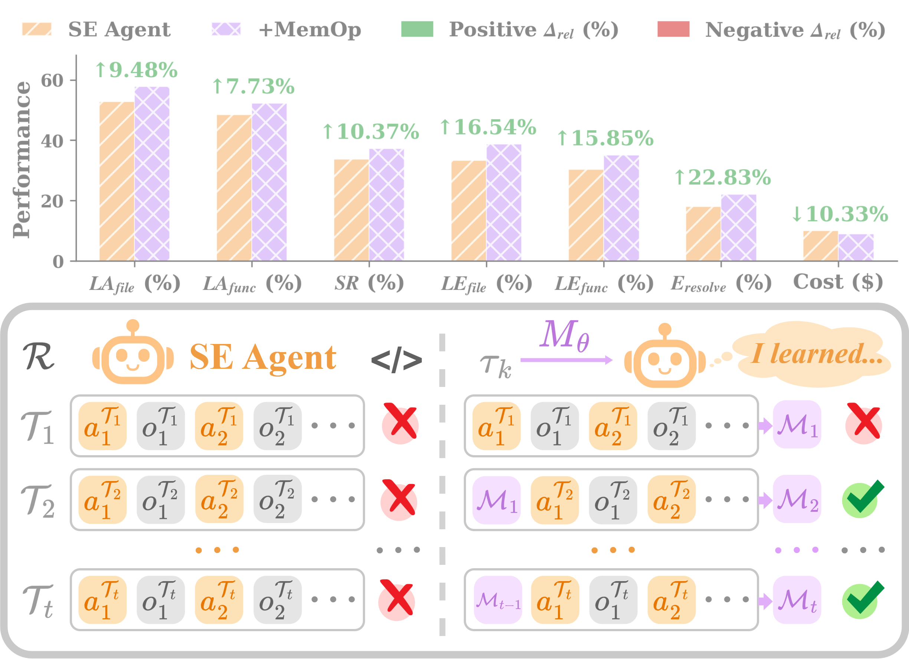
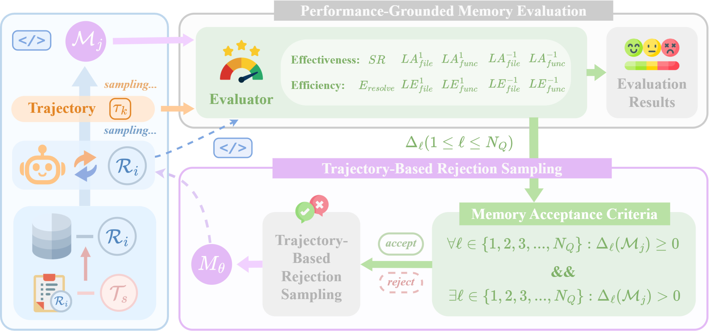

# **MemOp: Enhancing Software Engineering Through Closed-Loop Memory Optimization**

<p align="center">
  <a href="https://arxiv.org/abs/2606.05646"></a>
  &nbsp;&nbsp;
  <a href="https://arxiv.org/pdf/2606.05646"></a>
  &nbsp;&nbsp;
  <a href="https://xhguo7.github.io/MemOp/"></a>
  &nbsp;&nbsp;
  <a href="https://github.com/xhguo7/MemOp"></a>
  &nbsp;&nbsp;
  <a href="./LICENSE"></a>
</p>

<p align="center">
  
</p>

> **TL;DR.**
SE agents are episodic: they don't retain or refine experience across tasks. **MemOp** grounds *memory utility* in **validated downstream impact**, turning utility into both a task-agnostic evaluation benchmark and an annotation-free optimization signal. Single-episode and cross-episode results show up to **↑5.25%** absolute success rate, **↑4.63%** resolve efficiency, and **≥9.79%** relative cost reduction on SWE-Bench-Verified.

---

## **Method Overview**

**MemOp** grounds the design of memory-augmented SE agents in a single principle:

> *A memory is **useful** if and only if it measurably improves SE agent performance on downstream tasks.*

This outcome-grounded definition serves two roles at once:

1. 🌟 **An evaluation benchmark** — a rigorous, task-agnostic way to score any memory.
2. 🌟 **An optimization signal** — a reward to train the memory model **without external annotation**.

<p align="center">
  
  <p align="center"><em>Memory Utility is realized through <strong>performance-grounded memory evaluation</strong> and <strong>trajectory-level rejection sampling</strong>.</em></p>
</p>

The memory model M<sub>θ</sub> is trained in two stages, including **Stage I (SFT)** that acquires foundational memory generation and **Stage II (RL)** that optimizes directly toward downstream SE impact, and evaluated under two complementary regimes:

- **Single-Episode Memory Generation**: distill memory from one completed trajectory and reuse it immediately. Tests the fundamental quality of MemOp's memory generation in isolation.
- **Cross-Episode Memory Evolution**: evolve memory progressively across a sequence of tasks per repository. Tests long-horizon adaptability across episodes.


---

## **🌳 I. Env Setup**

**1. Create env:**
```bash
conda env create -f environment.yml
conda activate memop

# Install evaluation dependencies
cd evaluate
poetry install

# Install stage-I dependencies
cd s1
pip install -e .

# Install stage-II dependencies
cd s2
pip install -e .
```

**2. Model configuration**
* Copy `evaluate/config.template.toml` to `evaluate/config.toml` and add your model/API settings under an `[llm.<name>]` group.
* In the commands below, `<llm-proxy>` denotes that config group name (e.g. an `[llm.proxy]` group).


## **🌟 II. MemOp for Memory-Augmented Software Engineering**

### **2.1 Memory Sampling**

**1. Run Baseline Performance on `SWE-Bench-Verified`:**

```bash
# (1) Navigate to downstream evaluation dir
cd ./evaluate

# (2) Run inference
bash ./evaluation/swe_bench/scripts/run_infer.sh <llm-proxy> HEAD CodeActAgent <max-instance> <max-iter> 1 princeton-nlp/SWE-bench_Verified test

# (3) Evaluate resolve success rate
bash ./evaluation/swe_bench/scripts/eval_infer.sh ./evaluation/evaluation_outputs/model1_baseline1/princeton-nlp__SWE-bench_Verified-test/CodeActAgent/<llm-proxy>_maxiter_<max-iter>_N_v0.45.0-no-hint-run_1/output.jsonl "" princeton-nlp/SWE-bench_Verified test

# (4) Run our evaluation
bash ./evaluation/swe_bench/scripts/eval_localization.sh \
    --infer-dir ./evaluation/evaluation_outputs/model1_baseline1/princeton-nlp__SWE-bench_Verified-test/CodeActAgent/<llm-proxy>_maxiter_<max-iter>_N_v0.45.0-no-hint-run_1 \
    --dataset princeton-nlp/SWE-bench_Verified \
    --split test \
    --max-infer-turn <max-iter> \
    --align-with-max true
```

**2. Generate Memories from Trajectories**

* (1) Navigate to memory generation dir
    ```bash
    cd ./memop
    ```

* (2) Update configuration: open and edit `memop/scripts/run_memory.sh`
    ```bash
    # ====== Task ======
    MEM_TASK="memory_generation"
    CANDIDATE_NUM=4
    TRAJECTORY_IDX=4

    # ====== Memory Model ======
    SE_AGENT="Qwen3-Coder-30B-A3B-Instruct"
    MODEL_NAME="memory__ours__rl_from_sft__qwen3_4b_thinking"
    MEMORY_MODEL="openai/xuehang/rl_from_sft__qwen3_4b_thinking"

    API_KEY="(input your API key here)"
    BASE_URL="(input your base URL here)"
    TEMPERATURE=1.0
    INPUT_COST_PER_TOKEN=0.0
    OUTPUT_COST_PER_TOKEN=0.0

    # TRUNCATION_METHOD="middle"
    TRUNCATION_METHOD="last"

    # ====== Path ======
    DATA_PATH="/path/to/your/raw_trajectories.json"
    CONV_DIR="/path/to/your/conversation_histories.json"
    EVAL_PATH="/path/to/your/evaluation_results.json"
    SAVE_DIR="./outputs/saves__memory_${MODEL_NAME}__code_${SE_AGENT}"
    CACHE_DIR="/path/to/save/caches"  # you may want to choose somewhere with larger space
    TMP_DIR="/path/to/tmps"  # you may want to choose somewhere with larger space
    ```

* (3) Run memory generation
    ```bash
    # Run
    bash memop/scripts/run_memory.sh
    ```

**3. Outcome-Grounded Memory Filtering via Trajectory-Level Rejection Sampling**

* (a) Set memory candidate: `<output_attempt_idx>,<memory_candidate_idx>`
    * `<output_attempt_idx>`: the index of raw trajectory, starting from 0
    * `<memory_candidate_idx>`: the index of memory candidate, starting from 0

* (b) Run evaluation on candidate-augmented inference
    ```bash
    # (1) Navigate to downstream evaluation dir
    cd ./evaluate

    # (2) Run inference
    bash ./evaluation/swe_bench/run_memory_single_episode/run_infer_with_memory.sh <llm-proxy> HEAD CodeActAgent <max-instance> <max-iter> 1 princeton-nlp/SWE-bench_Verified test 1 swe <path/to/all_memory_candidates.json> <output_attempt_idx>,<memory_candidate_idx>

    # (3) Evaluate resolve success rate
    bash ./evaluation/swe_bench/scripts/eval_infer.sh ./evaluation/evaluation_outputs/outputs_with_single_episode_memory__trajectory<output_attempt_idx>_candidate<memory_candidate_idx>/princeton-nlp__SWE-bench_Verified-test/CodeActAgent/<llm-proxy>_maxiter_<max-iter>_N_v0.45.0-no-hint-run_1/output.jsonl "" princeton-nlp/SWE-bench_Verified test

    # (4) Run our evaluation
    bash ./evaluation/swe_bench/scripts/eval_localization.sh \
        --infer-dir ./evaluation/evaluation_outputs/outputs_with_memory__trajectory<output_attempt_idx>_candidate<memory_candidate_idx>/princeton-nlp__SWE-bench_Verified-test/CodeActAgent/<llm-proxy>_maxiter_<max-iter>_N_v0.45.0-no-hint-run_1 \
        --dataset princeton-nlp/SWE-bench_Verified \
        --split test \
        --max-infer-turn <max-iter> \
        --align-with-max true
    ```

* (c) Memory filtering via outcome-grounded rejection sampling
    ```bash
    # (1) Navigate to memory dir
    cd ./memop

    # (2) Calculate performance delta
    bash scripts/run_post_eval.sh
    ```


### **2.2 Memory Model Finetuning**
**1. Stage I**

* We adapt [Llamafactory](https://llamafactory.readthedocs.io/zh-cn/latest/) for memory model supervised finetuning
* Run Stage I training:
    ```bash
    cd ./s1
    llamafactory-cli train memory_sft/qwen3_4b.yaml
    ```
* Merge:
    ```bash
    cd ./s1
    llamafactory-cli export memory_sft/merge__qwen3_4b.yaml
    ```

**2. Stage II**

* We adapt [VERL](https://verl.readthedocs.io/en/latest/index.html) for memory model reinforcement learning
* Run Stage II training:
    ```bash
    cd ./s2
    bash memory_rl/qwen3_4b__from_sft__grpo.sh
    ```
* Merge
    ```bash
    cd ./s2
    python memory_rl/model_merger.py --local-dir /path/to/local/checkpoints
    ```


### **2.3 Memory Model Evaluation**

**1. SE Agent with Single-Episode Memory Augmentation**

```bash
# (1) Navigate to evaluation dir
cd ./evaluate

# (2) Run memory-augmented inference
bash ./evaluation/swe_bench/run_memory_single_episode/run_infer_with_memory.sh <llm-proxy> HEAD CodeActAgent <max-instance> <max-iter> 1 princeton-nlp/SWE-bench_Verified test 1 swe <path/to/all_memory_candidates.json> <output_attempt_idx>,<memory_candidate_idx>

# (3) Evaluate resolve success rate
bash ./evaluation/swe_bench/scripts/eval_infer.sh ./evaluation/evaluation_outputs/outputs_with_single_episode_memory__trajectory<output_attempt_idx>_candidate<memory_candidate_idx>/princeton-nlp__SWE-bench_Verified-test/CodeActAgent/<llm-proxy>_maxiter_<max-iter>_N_v0.45.0-no-hint-run_1/output.jsonl "" princeton-nlp/SWE-bench_Verified test

# (4) Evaluate all
bash ./evaluation/swe_bench/scripts/eval_localization.sh \
    --infer-dir ./evaluation/evaluation_outputs/outputs_with_memory__trajectory<output_attempt_idx>_candidate<memory_candidate_idx>/princeton-nlp__SWE-bench_Verified-test/CodeActAgent/<llm-proxy>_maxiter_<max-iter>_N_v0.45.0-no-hint-run_1 \
    --dataset princeton-nlp/SWE-bench_Verified \
    --split test \
    --max-infer-turn <max-iter> \
    --align-with-max true
```

**2. SE Agent with Cross-Episode Memory Augmentation**

```bash
# (1) Navigate to evaluation dir
cd ./evaluate

# (2) Run memory-augmented inference
bash ./evaluation/swe_bench/run_memory_cross_episode/run_infer_with_memory_cross_episode.sh <llm-proxy> HEAD CodeActAgent <max-instance> <max-iter> 1 princeton-nlp/SWE-bench_Verified test 1 swe <give-initial-memory-state-or-set-to-none> <output_attempt_idx>,<memory_candidate_idx>

# For example: No initial memory state
bash ./evaluation/swe_bench/run_memory_cross_episode/run_infer_with_memory_cross_episode.sh <llm-proxy> HEAD CodeActAgent <max-instance> <max-iter> 1 princeton-nlp/SWE-bench_Verified test 1 swe none <output_attempt_idx>,<memory_candidate_idx>

# (3) Evaluate resolve success rate
bash ./evaluation/swe_bench/scripts/eval_infer.sh ./evaluation/evaluation_outputs/outputs_cross_episode__with_memory/princeton-nlp__SWE-bench_Verified-test/CodeActAgent/<llm-proxy>_maxiter_<max-iter>_N_v0.45.0-no-hint-run_1/output.jsonl "" princeton-nlp/SWE-bench_Verified test

# (4) Evaluate all
bash ./evaluation/swe_bench/scripts/eval_localization.sh \
    --infer-dir ./evaluation/evaluation_outputs/outputs_cross_episode__with_memory/princeton-nlp__SWE-bench_Verified-test/CodeActAgent/<llm-proxy>_maxiter_<max-iter>_N_v0.45.0-no-hint-run_1 \
    --dataset princeton-nlp/SWE-bench_Verified \
    --split test \
    --max-infer-turn <max-iter> \
    --align-with-max true
```


## **🥰 Acknowledgement**

Our work is built upon [OpenHands](https://www.openhands.dev/), [Llamafactory](https://llamafactory.readthedocs.io/zh-cn/latest/), and [VERL](https://verl.readthedocs.io/en/latest/index.html). We sincerely thank their exceptional work!


## **📃 Citation**
If you find our work interesting, please kindly cite:
```
@article{guo2026memop,
    title={Enhancing Software Engineering Through Closed-Loop Memory Optimization},
    author={Guo, Xuehang and Wang, Zhiruo and Wang, Qingyun and Neubig, Graham and Wang, Xingyao},
    journal={arXiv preprint arXiv:2606.05646},
    url={https://arxiv.org/abs/2606.05646},
    year={2026}
}
```
