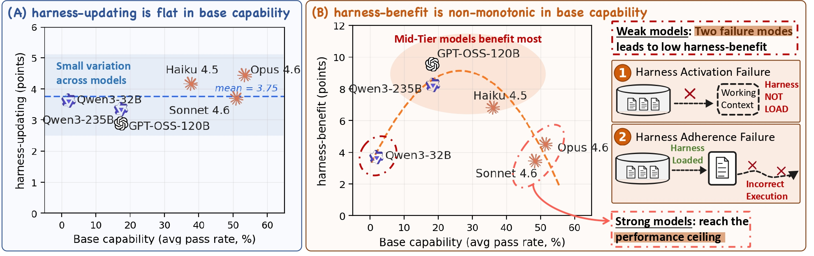

# Harness Updating Is Not Harness Benefit: Disentangling Evolution Capabilities in Self-Evolving LLM Agents

[](https://arxiv.org/abs/2605.30621)

Official implementation for **"Harness Updating Is Not Harness Benefit: Disentangling Evolution Capabilities in Self-Evolving LLM Agents."**

If you find this work helpful, please consider to cite our paper:

```bibtex
@article{lin2026harness,
  title={Harness Updating Is Not Harness Benefit: Disentangling Evolution Capabilities in Self-Evolving LLM Agents},
  author={Lin, Minhua and Wu, Juncheng and Wang, Zijun and Shi, Zhan and Sang, Yisi and He, Bing and Liu, Zewen and Wei, Tianxin and Wu, Zongyu and Zhang, Zhiwei and Wang, Dakuo and Zhang, Xiang and Dumoulin, Benoit and Xie, Cihang and Zhou, Yuyin and Wang, Suhang and Lu, Hanqing},
  journal={arXiv preprint arXiv:2605.30621},
  year={2026}
}
```

## Table of Contents

- [Abstract](#abstract)
- [Project Structure](#project-structure)
- [Installation](#installation)
- [Dataset Preparation](#dataset-preparation)
- [Artifact Entry Points](#artifact-entry-points)
- [Reproducing the Paper Experiments](#reproducing-the-paper-experiments)
  - [Exp0: Evolver-side Analysis (harness-updating)](#exp0-evolver-side-analysis-harness-updating)
  - [Exp1: Agent-side Analysis (harness-benefit)](#exp1-agent-side-analysis-harness-benefit)
- [Models](#models)
- [Citation](#citation)

## Overview

LLM agents are increasingly deployed as systems built around an editable external **harness**: prompts, skills, memories, and tools that shape task execution without changing model parameters. *Harness self-evolution* adapts such an agent by updating this harness from execution evidence.

<p align="center">
  
</p>

We separate two capabilities in this loop:

1. **Harness-updating**, exercised by the evolver, is the capability to produce useful persistent harness updates from evidence.
2. **Harness-benefit**, exercised by the agent, is the capability to use updated harnesses during task solving.

Pairing seven LLMs as agents and evolvers across three agentic benchmarks (SWE-bench Verified, MCP-Atlas, SkillsBench), the analysis reveals two findings:

- **Harness-updating is flat in base capability.** Models from different capability tiers produce harness updates that lead to surprisingly similar gains; even Qwen3.5-9B's updates yield gains comparable to those of Claude Opus 4.6.
- **Harness-benefit is non-monotonic in base capability.** Weak-tier models benefit little from updated harnesses, mid-tier models benefit most, and strong-tier models benefit less than mid-tier. We trace the low gains at the weak tier to two failure modes: weak-tier models may fail to activate relevant harness artifacts, or activate them but fail to follow them faithfully (measured by the Harness-Following Rate).

The results suggest that scaling the task-solving agent matters more than scaling the evolver, and that future agent training should directly target harness invocation and long-horizon instruction following.

## Project Structure

```
.
├── agent_evolve/                  # Core library
│   ├── algorithms/unified/        # UnifiedEngine: readers, operators, verifiers (the evolution engine)
│   ├── agents/{swe,mcp,skillbench}/   # Task-solving agents for the three benchmarks
│   ├── benchmarks/{swe_verified_mini,mcp_atlas,skillbench}/  # Benchmark adapters
│   ├── engine/                    # Evolution loop, history, observer, trial runner
│   ├── llm/                       # Bedrock / OpenAI-compatible LLM backends
│   └── contract/                  # Harness (workspace) contract: manifest, schema
│
├── examples/
│   ├── swe_examples/              # SWE-bench Verified runners (*_unified.py) + baseline (solve_all.py)
│   ├── mcp_examples/              # MCP-Atlas runner (run_adaptive_evolve_all_unified.py) + baseline
│   ├── skillbench_examples/       # SkillsBench runners (skillbench_evolve_*_unified.py)
│   ├── configs/                   # Per-benchmark evolution configs (swe / mcp / skillbench)
│   └── harness-evolution/         # Paper experiment orchestration
│       ├── run_exp0_unified_insitu.py    # Exp0: evolver-side (harness-updating)
│       ├── run_exp1_unified_insitu.py    # Exp1: agent-side (harness-benefit)
│       ├── run_exp1.py                   # Exp1 train/test split variant
│       ├── _region_picker.py + model_region_availability.json  # model nickname -> provider id / region
│       ├── scripts/                      # Single-seed sweep launchers + status dashboard
│       └── hfr_analysis/                 # Agent-side HFR diagnostic pipeline
│
├── seed_workspaces/{swe,mcp,skillbench-upstream-parity}/  # Initial harnesses (H_0)
├── docs/                          # Unified engine + benchmark setup docs
├── tests/                         # Unit tests (unified engine, scaffolding, isolation)
├── pyproject.toml
├── Makefile
└── .env.example
```

## Installation

Requires Python 3.11+.

```bash
git clone -b release/harness-evolution https://github.com/A-EVO-Lab/a-evolve.git
cd a-evolve

# Create environment
conda create -n aevolve python=3.11 -y
conda activate aevolve

# Editable install with the three paper benchmarks + dev tools
pip install -e ".[swe,mcp,skillbench,dev]"
# or, all extras:
pip install -e ".[all,dev]"
```

Optional-dependency extras: `swe` (SWE-bench Verified), `mcp` (MCP-Atlas), `skillbench` (SkillsBench), `all`, `dev` (pytest/ruff). `make install` runs `pip install -e ".[all,dev]"`.

### Runtime Configuration

Copy the example file and fill in the credentials required by the model providers and benchmark backends you use:

```bash
cp .env.example .env
```

The paper scripts use short model nicknames such as `opus46`, `sonnet46`, and `qwen235b`. These are resolved by `examples/harness-evolution/model_region_availability.json` and `_region_picker.py`. Benchmark-specific requirements are documented in `docs/mcp-atlas-demo.md` and `docs/skillbench-setup.md`.

## Dataset Preparation

- **SWE-bench Verified** (`swe`): the HuggingFace dataset `MariusHobbhahn/swe-bench-verified-mini` (or `princeton-nlp/SWE-bench_Verified`) downloads on first use. Each task runs in a SWE-bench Docker image pulled on demand, so a running Docker daemon is required. Seed harness: `seed_workspaces/swe/`.
- **MCP-Atlas** (`mcp`): the HuggingFace dataset `ScaleAI/MCP-Atlas` downloads on first use. Tasks run against MCP servers in a container (`--docker-image`, or `--external-container-url` for a pre-running container) and require per-server API keys in a `.env`. Evaluation uses an LLM judge (Gemini 2.5 Pro via LiteLLM by default). Seed harness: `seed_workspaces/mcp/`. See `docs/mcp-atlas-demo.md`.
- **SkillsBench** (`skillbench`): tasks are auto-cloned from `https://github.com/benchflow-ai/skillsbench` (pinned commit `828bb921...`) into `~/.cache/agent-evolve/skillbench/` on first use; set `SKILLBENCH_REPO_DIR` to use a local clone. Seed harness: `seed_workspaces/skillbench-upstream-parity/`. See `docs/skillbench-setup.md`.

## Artifact Entry Points

Each benchmark runner copies an initial harness, solves a task stream, updates the harness between batches, and writes metrics plus the evolved `workspace/` to the output directory. Pass `--help` to any runner for the full argument list.

**SWE-bench Verified:**

```bash
python examples/swe_examples/evolve_sequential_unified.py \
  --cycles 3 --limit 50 --batch-size 5 --parallel 5 --feedback minimal \
  --model-id us.anthropic.claude-opus-4-6-v1 --region us-west-2 \
  --dataset MariusHobbhahn/swe-bench-verified-mini \
  --seed-workspace seed_workspaces/swe --output-dir logs/swe_evolve
```

No-evolve baseline:

```bash
python examples/swe_examples/solve_all.py \
  --dataset MariusHobbhahn/swe-bench-verified-mini \
  --model-id us.anthropic.claude-opus-4-6-v1 \
  --workers 5 --limit 50 --output-dir logs/swe_baseline
```

**MCP-Atlas:**

```bash
python examples/mcp_examples/run_adaptive_evolve_all_unified.py \
  --cycles 3 --batch-size 30 --limit 500 \
  --solver-model us.anthropic.claude-opus-4-6-v1 \
  --judge-model us.anthropic.claude-sonnet-4-6 --region us-west-2 \
  --docker-image <mcp-atlas-image> --env-file .env \
  --dataset ScaleAI/MCP-Atlas --seed-workspace seed_workspaces/mcp \
  --output-dir logs/mcp_evolve

python examples/mcp_examples/adaptive_evolve_baseline.py \
  --limit 500 --batch-size 30 --workers 5 \
  --solver-model us.anthropic.claude-opus-4-6-v1 \
  --judge-model us.anthropic.claude-sonnet-4-6 \
  --docker-image <mcp-atlas-image> --env-file .env \
  --seed-workspace seed_workspaces/mcp --output-dir logs/mcp_baseline
```

**SkillsBench:**

```bash
python examples/skillbench_examples/skillbench_evolve_split_unified.py \
  --evolve-limit 20 --batch-size 1 --max-cycles 1 \
  --train-parallel 1 --test-parallel 5 \
  --model-id us.anthropic.claude-opus-4-6-v1 --region us-west-2 \
  --feedback-level tests \
  --seed-workspace seed_workspaces/skillbench-upstream-parity \
  --run-dir logs/skillbench_split
```

## Reproducing the Paper Experiments

The main experiment drivers live in `examples/harness-evolution/`. They expose the two comparisons studied in the paper: Exp0 varies the evolver to measure harness-updating, while Exp1 varies the task-solving agent to measure harness-benefit.

Run the commands below from the repository root. Model nicknames such as `opus46`, `sonnet46`, and `qwen235b` are listed in [Models](#models); `--evolver none` runs the no-evolution baseline.

### Exp0: Evolver-side Analysis (harness-updating)

Fix the agent over the anchor set and vary the evolver, isolating each evolver's harness-updating capability.

```bash
# One cell:
python examples/harness-evolution/run_exp0_unified_insitu.py \
  --solver opus46 --evolver qwen35_9b --benchmark mcp --seed 42 \
  --region-strategy hash --output-root results/exp0_unified_insitu

# Full single-seed sweep:
bash examples/harness-evolution/scripts/phase0_unified_insitu_single_seed.sh
```

### Exp1: Agent-side Analysis (harness-benefit)

Fix the evolver over the anchor set and vary the agent, isolating each agent's harness-benefit.

```bash
# One cell (in-situ route, comparable cell-by-cell with Exp0):
python examples/harness-evolution/run_exp1_unified_insitu.py \
  --solver qwen32b --evolver opus46 --benchmark sb --seed 42 \
  --region-strategy hash --output-root results/exp1_unified_insitu

# Full single-seed sweep + progress dashboard:
bash examples/harness-evolution/scripts/phase1_unified_insitu_single_seed.sh
bash examples/harness-evolution/scripts/check_status.sh
```

`run_exp1.py` provides a train/test split route (evolve on a subset, evaluate on a held-out slice) for unbiased harness-benefit estimation.

#### Harness-Following Rate (HFR) Diagnostic

As an agent-side diagnostic, `hfr_analysis/pipeline.py` measures how faithfully an agent follows the procedural instructions in an evolved SkillsBench skill. The pipeline extracts per-skill rubrics, judges trajectory adherence, and computes mechanical proxies such as retrieval-to-use gap, early termination, and answer-before-validation.

```bash
python examples/harness-evolution/hfr_analysis/pipeline.py --max-workers 4 --stages 1,2,4
```

## Models

We pair the following six LLMs as task-solving agents and evolvers: Claude Opus 4.6, Claude Sonnet 4.6, Claude Haiku 4.5, Qwen3-235B-A22B, Qwen3-32B, GPT-OSS-120B.

In addition, we also use Qwen 3.5-9B as the evolver to test whether a substantially smaller open model can still produce useful harness updates.

| Nickname | Model |
|----------|-------|
| `opus46` | Claude Opus 4.6 |
| `sonnet46` | Claude Sonnet 4.6 |
| `haiku45` | Claude Haiku 4.5 |
| `qwen235b` | Qwen3-235B-A22B |
| `qwen32b` | Qwen3-32B |
| `qwen35_9b` | Qwen3.5-9B |
| `gptoss120b` | GPT-OSS-120B |
